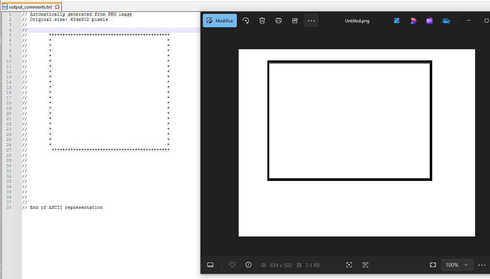
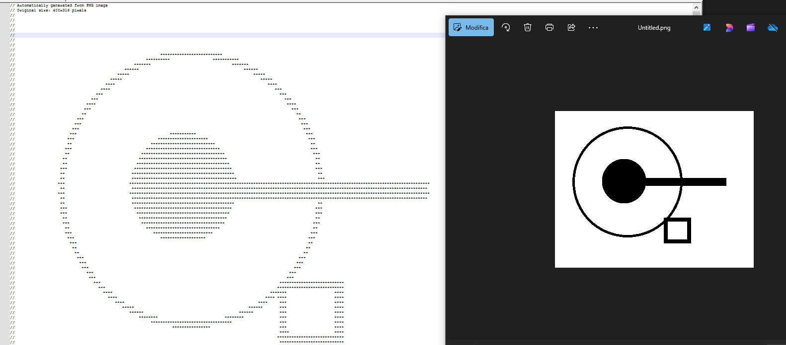
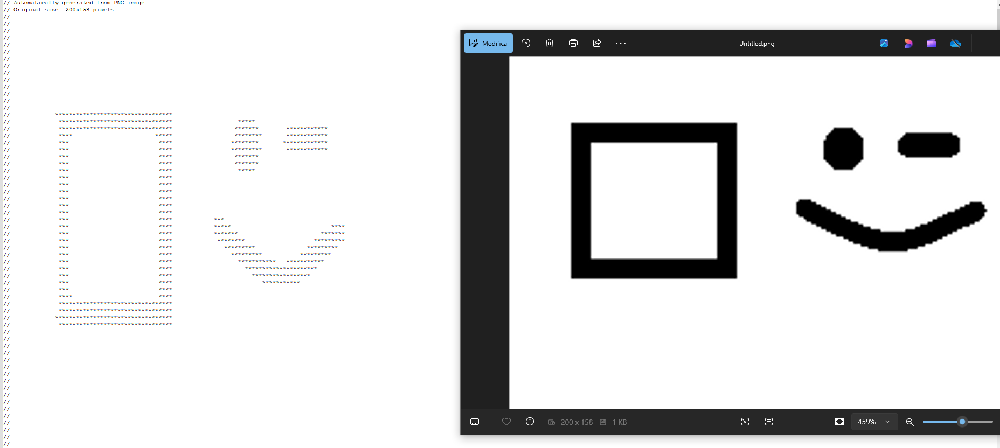

# ImageToCommentConverter
Python snippet that converts a simple image in a block of code, given the specific language.

Images could be simple geometrical items, drawn with Paint, or even something more complex. *Be careful*: more complex images, thinner lines or higher resolution would create a bigger comment.

## Startup Guide
- Download the repo or even just .py code
- Start .py file
- Follow instructions
- Output file would appear in the same directory of the given image, in a output_comments.txt file.

### Examples: 

Enjoy!

